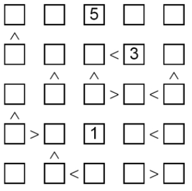

# futoshiki

Futoshiki é um puzzle np-completo e só pode ser resolvido (ou declarado impossível) por busca exaustiva. Sendo assim as únicas melhorias possíveis à solução do problema são podas, heurísticas e implementações otimizadas.
  
Este repositório contem implementações **altamente otimizadas** da busca completa pura, e de heurísticas, onde os custos amortizados de uma recursão são:

Busca pura, com poda local: Otimizado de 

para 

, resultando em 16 milhões de recursões por segundo*

Heurística Checagem adiante: Otimizado de 

para 

– 3 milhões de recursões por segundo*

Heurística MRV: Otimizado de 

para 

– 300 mil recursões por segundo*

Onde  é a quantidade de algarismos possíveis, 
 é a largura do tabuleiro, e 

é a quantidade de células do tabuleiro.

*implementado em java, testado em single thread em processador mobile de 15w

[Mais detalhes das soluções](relatorio-cezanne.pdf)

[Descrição do problema](Futoshiki.pdf)

Referência das heurísticas: Russell and Norvig - Artificial intelligence: a modern approach 3rd ed., páginas 216-217
